# JNOTE

## Introducing oneself <cite>(Kamiya, §1)</cite>

> <ruby>私<rt>わたし</rt></ruby>は<ruby>田中<rt>たかな</rt></ruby>です。

> 私は田中だ。

Common, textbook way on introducing oneself, assuming one’s surname (last name) was 田中, Tanaka.

だ is familiar. です is politer. There are at least two dimensions in interpersonal relations. *Status*, and *distance*. One can be higher status (older, more experienced, etc.) than someone, or lower, or the same; one can also be close to someone (family, longtime friend), or distant from them. One can hurt or offend with speech assuming the wrong status or distance—too close, too distant, too familiar, too formal.

は is pronounced わ—don’t ask.

Obligatory technical stuff: please don’t read this. は used like this indicates that the thing it followed is the topic of the conversation—subsequent references to it can be dropped. Meanwhile, です and だ are both copulas, i.e., they couple two things together, specifically 私 and 田中. In English, “is” is a copula, in “I am (is) Tanaka” but English can misguide you because the “is”-copula is a verb, “to be”. The copulas in Japanese aren’t verbs. If you’ve read this paragraph, forgive me for including this and keep reading—descriptive examples are much more important than descriptive grammars.

## Another way

One can also say,

> 私が田中です。

The difference is は versus が, the distinction between the two being guaranteed to be discussed in your “Japanese WTF” book. The way I think about it, は lenses attention towards what follows it—when you say 「私は…」 we are hanging on to the edge of our seats, waiting for what comes after: you are WHOM? Tell us, tell us!

Meanwhile, が lenses attention to the thing just before it: by the time I’ve said 「私が…」 you know the most important thing is 私—no matter what follows, the important thing is that it’s 私 that’s that. Not you, not her, but me.

## Pronouns

More first-person pronouns: more polite than <ruby>私<rt>わたし</rt></ruby> is <ruby>私<rt>わたくし</rt></ruby>. The teacher and the superintendent in [３５歳の高校生](http://wiki.d-addicts.com/35-sai_no_Koukousei) both use this. The superintendent also uses <ruby>我<rt>わ</rt></ruby>が.

A feminine reading is <ruby>私<rt>あたし</rt></ruby>.

Men (and [certain](http://tvtropes.org/pmwiki/pmwiki.php/Main/Bokukko) women) can use <ruby>僕<rt>ぼく</rt></ruby>. The male author–ethnogother of [Crested Kimono](http://www.goodreads.com/review/show/878425523) (1991) finds that he must refer to himself with 僕 to prevent matrons from trying to set him up with young women, since that’s the pronoun then used by students.

In very familiar settings, men can refer to themselves as <ruby>俺<rt>おれ</rt></ruby>.

In this scene of <ruby>耳<rt>みみ</rt></ruby>をすませば　(*Whisper of the Heart*, 1995), fourteen-year-old <ruby>雫<rt>しずく</rt></ruby> uses <ruby>私<rt>あたし</rt></ruby> while her father uses <ruby>僕<rt>ぼく</rt></ruby>.

> 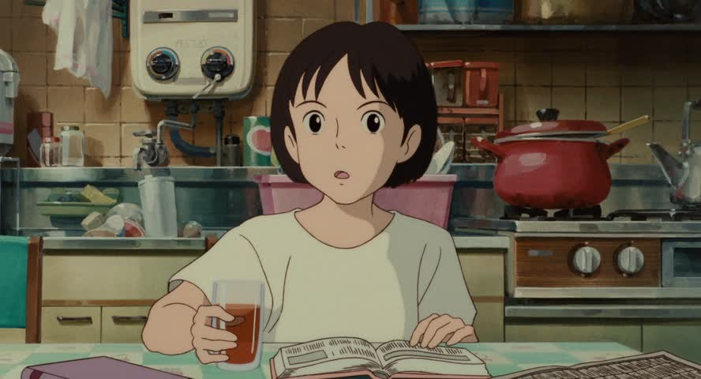 
> <ruby>私<rt>あたし</rt></ruby>　カードのほうが<ruby>好<rt>す</rt></ruby>き。
>
>  
> 僕も　そうだけどね。

Later, when talking to <ruby>西<rt>にし</rt></ruby>さん, an elderly musician–artisan, she distinctly refers to herself as <ruby>私<rt>わたし</rt></ruby>.

> 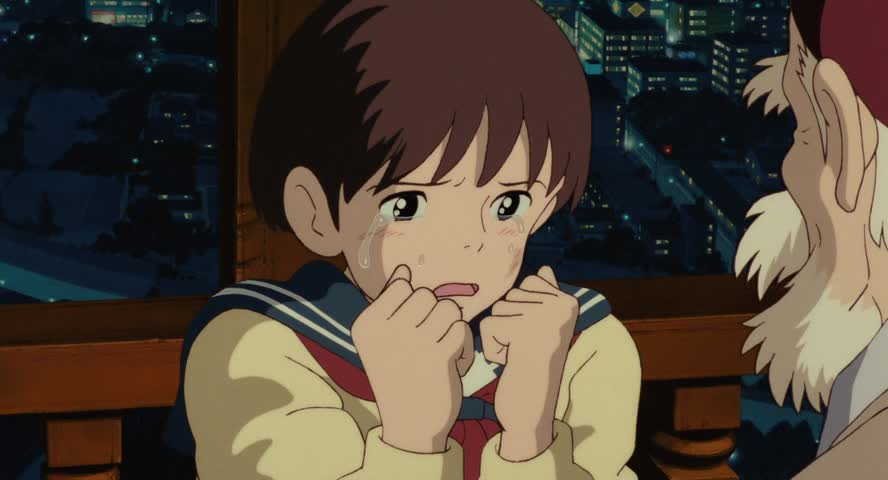 
> <ruby>私<rt>わたし</rt></ruby>　書いてみて分かったんです。

(She’s sad here because her Quest—writing a novel—just ended. The weight of giving birth to an artistic achievement has moved her to tears.)

Meanwhile, 雫’s male classmates <ruby>杉村<rt>すぎむら</rt></ruby> and <ruby>聖司<rt>せいじ</rt></ruby> refer to themselves with 俺 when talking to them.

> 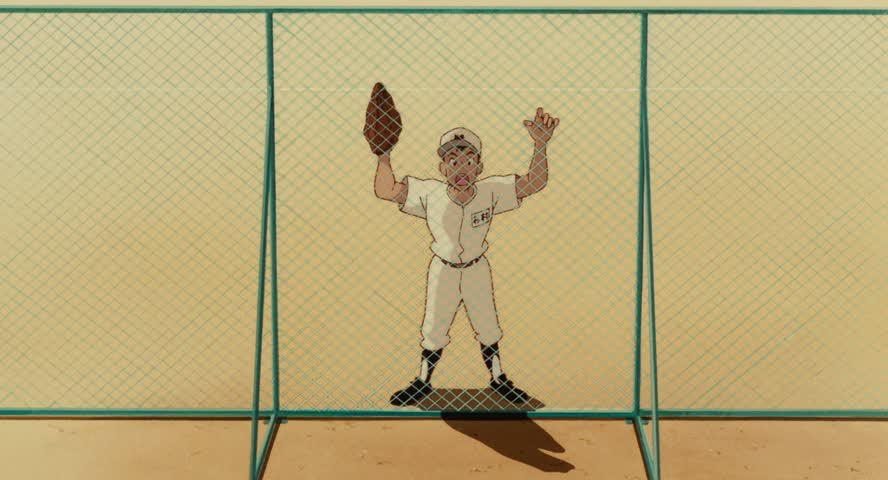 
> （杉村）　俺のバッグ取ってくれる？

⋮

> 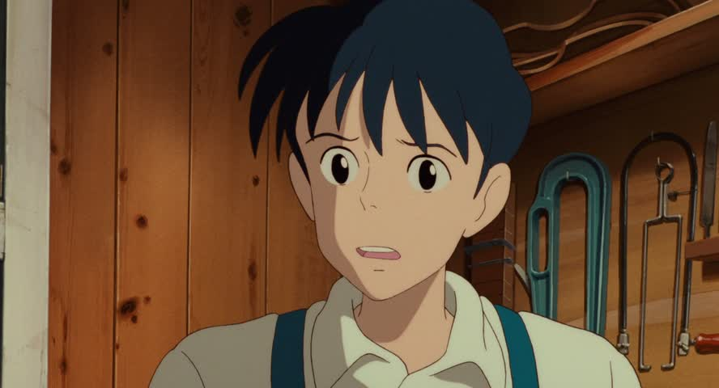 
> 俺は天沢。

Though knowledge of pronouns did color my interpretation of the film, I won’t take these examples too seriously. Real life is the best indicator for which pronouns are appropriate when, not film.

The second-person pronoun (“you”), at <ruby>私<rt>わたし</rt></ruby>-grade politeness, is あなた, while <ruby>君<rt>きみ</rt></ruby> and お<ruby>前<rt>まえ</rt></ruby> are increasingly very familiar.

The third-person pronouns of <ruby>彼<rt>かれ</rt></ruby> and <ruby>彼女<rt>かのじ</rt></ruby> are also used to refer to boy/girlfriends, and these, like the second-person pronouns, are used sparingly.

あの<ruby>人<rt>ひと</rt></ruby> means “that person” and can be a handy pronoun.

Just refer to people, even the person you’re talking to, by their family name plus the さん honorific, e.g., 田中さん  <cite>(Kamiya, §2)</cite>. Just don’t give yourself or your family members a さん.

## Noun phrases with の <cite>(Kamiya, §2)</cite>

In `(noun 1) の (noun 2)`, that `の` means the first noun modifies the second. Often it’s just possessive, per 『<ruby>君<rt>きみ</rt></ruby>の<ruby>名<rt>な</rt></ruby>は』[⋰](http://www.animenewsnetwork.com/encyclopedia/anime.php?id=18171) but can be much more.

雫’s teacher asks why she can’t wait till the library’s <ruby>次<rt>next</rt></ruby>の<ruby>開放<rt>open</rt></ruby><ruby>日<rt>day</rt></ruby>:

> 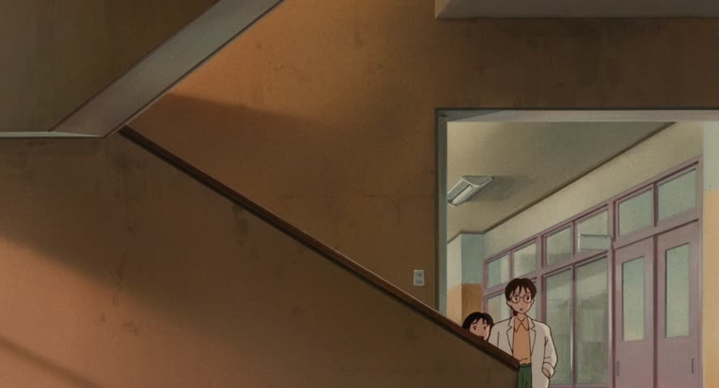 
> <ruby>次<rt>つぎ</rt></ruby>の<ruby>開放<rt>かいほう</rt></ruby><ruby>日<rt>び</rt></ruby>まで待てないの？

She then suggests asking a <ruby>ベテラン<rt>veteran</rt></ruby>の<ruby>先生<rt>teacher</rt></ruby> for gossip:

> 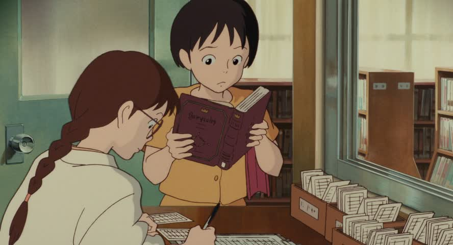 
> ベテランの<ruby>先生<rt>せんせい</rt></ruby>に聞いてみな。

の can also be chained:

> 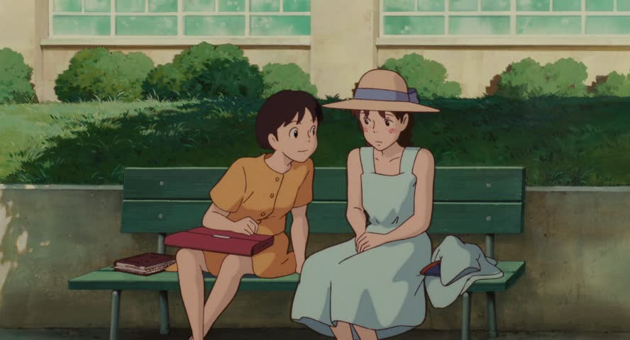 
> <ruby>他<rt>ほか</rt></ruby>のクラスの<ruby>子<rt>こ</rt></ruby>　少しカッコよかった。

雫’s close friend <ruby>夕子<rt>ゆうこ</rt></ruby> is talking about receiving a letter from <ruby>他<rt>another</rt></ruby>の<ruby>クラス<rt>class</rt></ruby>の<ruby>子<rt>kid</rt></ruby>.

の can also do the following, with <ruby>誰<rt>だれ</rt></ruby> meaning “who” and with <ruby>シャツ<rt>shirt</rt></ruby>:

> そのシャツは<ruby>誰<rt>だれ</rt></ruby>の？  
> 田中さんのです。

where the reply is short for

> そのシャツは田中さんのです。

History note: <ruby>平<rt>たいら</rt></ruby>の<ruby>清盛<rt>きよもり</rt></ruby> was the proto-shogun hero in the epic Tale of the Heike.

## KSA <cite>(Kamiya, §3)</cite>

“KSA” is an abbreviation for the pronouns:

- これ, “this, close to the speaker”
- それ, “that, close to the listener”, and
- あれ, “that, far from both speaker and listener”.

夕子 asks, “what is this?!”

> 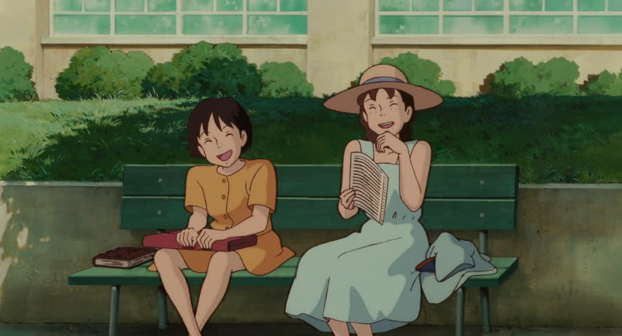 
> <ruby>何<rt>なに</rt></ruby>これ！

The dashing 杉村 asks 雫 to throw him *that* sports bag by them:

> 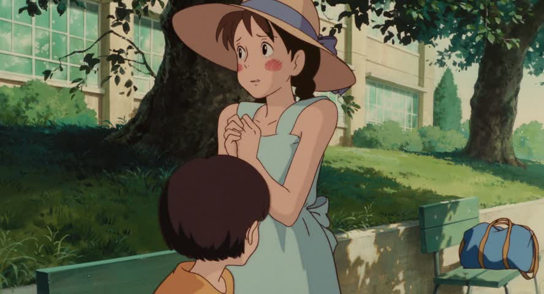 
> それ<ruby>投<rt>な</rt></ruby>げて～！

When 雫 asks him which is his violin, 聖司 gestures and says

> 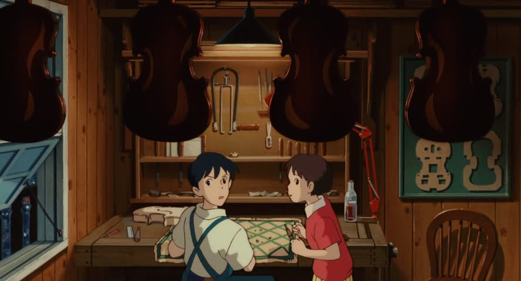 
> あれ。

More formal variants of these are

- こちら
- そちら
- あちら,

and can effectively be used as personal pronouns. When answering the phone, 田中さん might say

> こちらは田中です。

Adjectival forms of these follow the same first sound:

- この人, this person by me.
- その人, the person by you.
- あの人, that person over there.

There’s this priceless bit in 紅の豚 (*Porco Rosso*, 1992) where the eponymous pilot addresses his airplane’s failing engine:

>  
> この…！

## Questions with か <cite>(Kamiya, §4)</cite>

聖司 asks if this book in his hands is 雫’s:

> 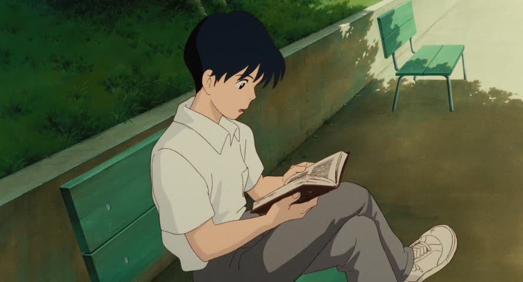 
> あぁ　これ　あんたのか。

To specify multiple alternatives, chain か like so:

> <ruby>朝<rt>あさ</rt></ruby>はパンですか, ご<ruby>飯<rt>はん</rt></ruby>ですか。

Here, we are asking whether in the <ruby>朝<rt>morning</rt></ruby> it’s <ruby>パン<rt>bread</rt></ruby> or <ruby>ご飯<rt>rice</rt></ruby>.

## Who? <ruby>誰<rt>だれ</rt></ruby>？ <cite>(Kamiya, §5)</cite>

夕子 asks 雫 who that guy is that she’s glaring at.

> 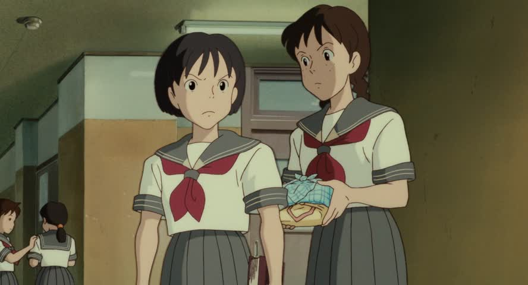 
> 雫　<ruby>誰<rt>だれ</rt></ruby>？　あいつ？ へ行く気？

She could say this more “properly” as 「あいつはだれ？」, for <ruby>あいつ<rt>that one</rt></ruby> (very informal ungendered third-person pronoun).

## What? <ruby>何<rt>なに</rt></ruby>？ <cite>(Kamiya, §5)</cite>

We already used this example:

>  
> <ruby>何<rt>なに</rt></ruby>これ！

This is short for 「これは何！」.

It can be abbreviated as なん to be more euphonious.

>  
> これ　<ruby>何<rt>なん</rt>ですか？

Here, the は has been left off—it officially ought to be 「これは何ですか？」.

Note for both 誰 and 何, start a sentence with the topic, followed by は (the topic marker), and then tack on the appropriate word to make it a who or what question: 「Ｘは誰？」 and 「Ｙは何？」. Optionally add 「…ですか？」.

I must close with a furious 雫 slamming the fridge door and asking “what the heck?!”:

> 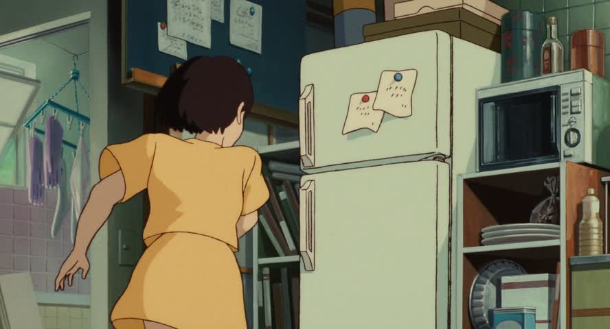 
> <ruby>何<rt>なに</rt></ruby>よ！

## Negating だ／です <cite>(Kamiya, §6)</cite>

Recall that the first section asked you not to read that だ and です (more polite) were *copulas*, i.e., they couple two parts of the sentence—like a linguistic equal sign, `X = Y`. It’s important to be able to negate the copula, i.e., say something isn’t something else, or `X ≠ Y`.

| original | negated | negated, informal |
|---|---|---|
| だ | ではない | じゃない |
| です | ではありません | じゃありません |

は in ではない and ではありません is pronounced わ.

雫 hopes this isn’t a <ruby>夢<rt>dream</rt></ruby>:

> 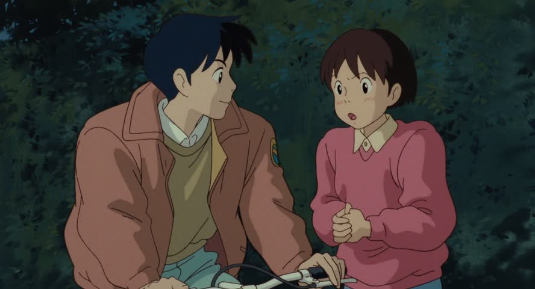 
> <ruby>夢<rt>ゆめ</rt></ruby>じゃないよね？

(The よ (~emphasis) and ね (~seeking agreement) are fillers.)

## “Also” via も <cite>(Kamiya, §7)</cite>

Replacing the topic marker は with も means “also” or “as well” (“neither” for negative sentences). We’ve seen this example above:

>  
> 僕も　そうだけどね。

雫 had just said she likes library cards better than barcodes, and her father agrees—“me too”.

Here’s an example with a negated sentence:

> 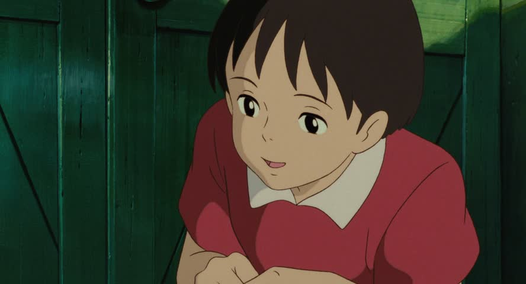 
> <ruby>君<rt>きみ</rt></ruby>も　かわいくないね　私そっくり。

雫 says that *neither* she nor the cat (whom she addresses as <ruby>君<rt>きみ</rt></ruby>, see above) is <ruby>かわいい<rt>cute</rt></ruby>. (We’ll see how the adjective かわいい gets negated below.)

# References

Kamiya, Taeko. <cite>Japanese Sentence Patterns for Effective Communication</cite>, Kodansha (2005).
