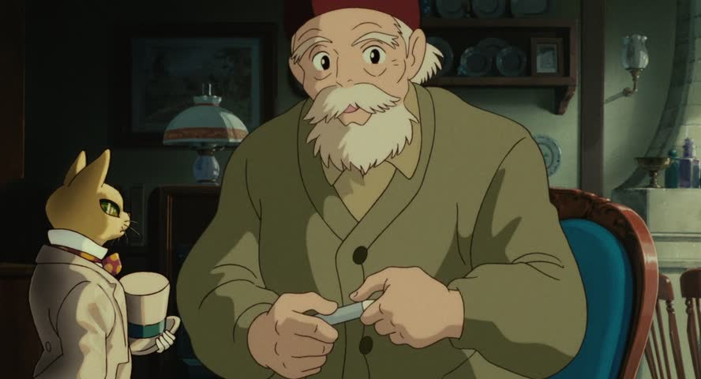
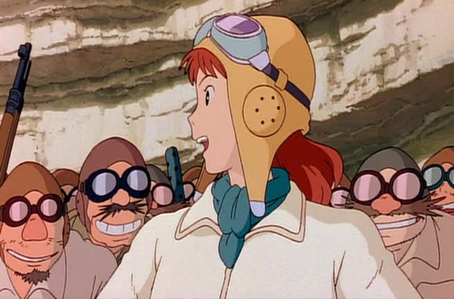
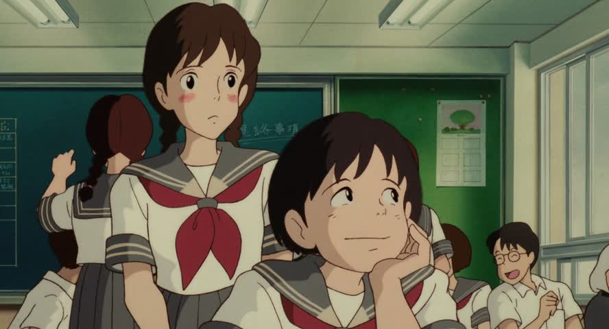
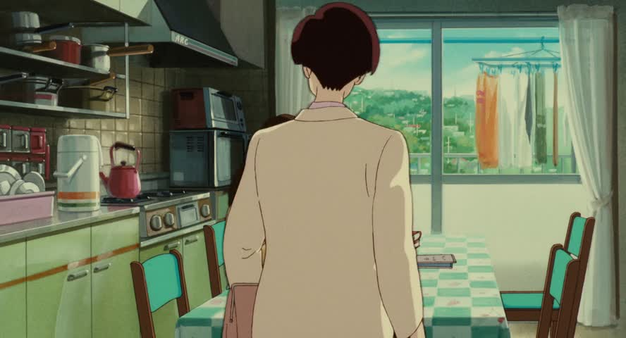
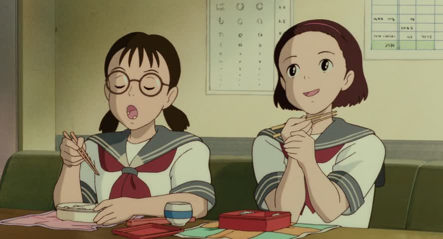

# JNOTE

## Prerequisites

Spend a couple of hours, in one sitting or over a couple of days, learning hiragana using visual stories mnemonic that will delight you—[Memrise’s Basic Hiragana 1](https://www.memrise.com/course/58584/basic-hiragana-1/) course will get you sorted. Then glance at the [Basic Hiragana 2](https://www.memrise.com/course/58802/basic-hiragana-2-2/) course to complete it.

If you’re the type that needs to read an authoritative and persuasive article before diving into something, Josh Foer’s [ode to Memrise](https://www.theguardian.com/education/2012/nov/09/learn-language-in-three-months) in the Guardian is how I got hooked.

Less important for this document is katakana. Once you learn hiragana, spend an hour with [Memrise’s Basic Katakana 1](https://www.memrise.com/course/63113/basic-katakana-1/) and you’ll be set.

## Introducing oneself <cite>(Kamiya, §1)</cite>

> <ruby>私<rt>わたし</rt></ruby>は<ruby>田中<rt>たかな</rt></ruby>です。

> 私は田中だ。

Common, textbook way on introducing oneself, assuming one’s surname (last name) was 田中, Tanaka.

だ is familiar. です is politer. There are at least two dimensions in interpersonal relations. *Status*, and *distance*. One can be higher status (older, more experienced, etc.) than someone, or lower, or the same; one can also be close to someone (family, longtime friend), or distant from them. One can hurt or offend with speech assuming the wrong status or distance—too close, too distant, too familiar, too formal.

は is pronounced わ—don’t ask.

Obligatory technical stuff: please don’t read this. は used like this indicates that the thing it followed is the topic of the conversation—subsequent references to it can be dropped. Meanwhile, です and だ are both copulas, i.e., they couple two things together, specifically 私 and 田中. In English, “is” is a copula, in “I am (is) Tanaka” but English can misguide you because the “is”-copula is a verb, “to be”. The copulas in Japanese aren’t verbs. If you’ve read this paragraph, forgive me for including this and keep reading—descriptive examples are much more important than descriptive grammars.

## Another way

One can also say,

> 私が田中です。

The difference is は versus が, the distinction between the two being guaranteed to be discussed in your “Japanese WTF” book. The way I think about it, は lenses attention towards what follows it—when you say 「私は…」 we are hanging on to the edge of our seats, waiting for what comes after: you are WHOM? Tell us, tell us!

Meanwhile, が lenses attention to the thing just before it: by the time I’ve said 「私が…」 you know the most important thing is 私—no matter what follows, the important thing is that it’s 私 that’s that. Not you, not her, but me.

## Pronouns

More first-person pronouns: more polite than <ruby>私<rt>わたし</rt></ruby> is <ruby>私<rt>わたくし</rt></ruby>. The teacher and the superintendent in [３５歳の高校生](http://wiki.d-addicts.com/35-sai_no_Koukousei) both use this. The superintendent also uses <ruby>我<rt>わ</rt></ruby>が.

A feminine reading is <ruby>私<rt>あたし</rt></ruby>.

Men (and [certain](http://tvtropes.org/pmwiki/pmwiki.php/Main/Bokukko) women) can use <ruby>僕<rt>ぼく</rt></ruby>. The male author–ethnogother of [Crested Kimono](http://www.goodreads.com/review/show/878425523) (1991) finds that he must refer to himself with 僕 to prevent matrons from trying to set him up with young women, since that’s the pronoun then used by students.

In very familiar settings, men can refer to themselves as <ruby>俺<rt>おれ</rt></ruby>.

In this scene of <ruby>耳<rt>みみ</rt></ruby>をすませば　(*Whisper of the Heart*, 1995), fourteen-year-old <ruby>雫<rt>しずく</rt></ruby> uses <ruby>私<rt>あたし</rt></ruby> while her father uses <ruby>僕<rt>ぼく</rt></ruby>.

>  
> <ruby>私<rt>あたし</rt></ruby>　カードのほうが<ruby>好<rt>す</rt></ruby>き。
>
>  
> 僕も　そうだけどね。

Later, when talking to <ruby>西<rt>にし</rt></ruby>さん, an elderly musician–artisan, she distinctly refers to herself as <ruby>私<rt>わたし</rt></ruby>.

>  
> <ruby>私<rt>わたし</rt></ruby>　書いてみて分かったんです。

(She’s sad here because her Quest—writing a novel—just ended. The weight of giving birth to an artistic achievement has moved her to tears.)

Meanwhile, 雫’s male classmates <ruby>杉村<rt>すぎむら</rt></ruby> and <ruby>聖司<rt>せいじ</rt></ruby> refer to themselves with 俺 when talking to them.

>  
> （杉村）　俺のバッグ取ってくれる？

⋮

>  
> 俺は天沢。

Though knowledge of pronouns did color my interpretation of the film, I won’t take these examples too seriously. Real life is the best indicator for which pronouns are appropriate when, not film.

The second-person pronoun (“you”), at <ruby>私<rt>わたし</rt></ruby>-grade politeness, is あなた, while <ruby>君<rt>きみ</rt></ruby> and お<ruby>前<rt>まえ</rt></ruby> are increasingly very familiar.

The third-person pronouns of <ruby>彼<rt>かれ</rt></ruby> and <ruby>彼女<rt>かのじ</rt></ruby> are also used to refer to boy/girlfriends, and these, like the second-person pronouns, are used sparingly.

あの<ruby>人<rt>ひと</rt></ruby> means “that person” and can be a handy pronoun.

Just refer to people, even the person you’re talking to, by their family name plus the さん honorific, e.g., 田中さん  <cite>(Kamiya, §2)</cite>. Just don’t give yourself or your family members a さん.

## Noun phrases with の <cite>(Kamiya, §2)</cite>

In `(noun 1) の (noun 2)`, that `の` means the first noun modifies the second. Often it’s just possessive, per 『<ruby>君<rt>きみ</rt></ruby>の<ruby>名<rt>な</rt></ruby>は』[⋰](http://www.animenewsnetwork.com/encyclopedia/anime.php?id=18171) but can be much more.

雫’s teacher asks why she can’t wait till the library’s <ruby>次<rt>next</rt></ruby>の<ruby>開放<rt>open</rt></ruby><ruby>日<rt>day</rt></ruby>:

>  
> <ruby>次<rt>つぎ</rt></ruby>の<ruby>開放<rt>かいほう</rt></ruby><ruby>日<rt>び</rt></ruby>まで待てないの？

She then suggests asking a <ruby>ベテラン<rt>veteran</rt></ruby>の<ruby>先生<rt>teacher</rt></ruby> for gossip:

>  
> ベテランの<ruby>先生<rt>せんせい</rt></ruby>に聞いてみな。

の can also be chained:

>  
> <ruby>他<rt>ほか</rt></ruby>のクラスの<ruby>子<rt>こ</rt></ruby>　少しカッコよかった。

雫’s close friend <ruby>夕子<rt>ゆうこ</rt></ruby> is talking about receiving a letter from <ruby>他<rt>another</rt></ruby>の<ruby>クラス<rt>class</rt></ruby>の<ruby>子<rt>kid</rt></ruby>.

の can also do the following, with <ruby>誰<rt>だれ</rt></ruby> meaning “who” and with <ruby>シャツ<rt>shirt</rt></ruby>:

> そのシャツは<ruby>誰<rt>だれ</rt></ruby>の？  
> 田中さんのです。

where the reply is short for

> そのシャツは田中さんのです。

History note: <ruby>平<rt>たいら</rt></ruby>の<ruby>清盛<rt>きよもり</rt></ruby> was the proto-shogun hero in the epic Tale of the Heike.

## KSA <cite>(Kamiya, §3)</cite>

“KSA” is an abbreviation for the pronouns:

- これ, “this, close to the speaker”
- それ, “that, close to the listener”, and
- あれ, “that, far from both speaker and listener”.

夕子 asks, “what is this?!”

>  
> <ruby>何<rt>なに</rt></ruby>これ！

The dashing 杉村 asks 雫 to throw him *that* sports bag by them:

>  
> それ<ruby>投<rt>な</rt></ruby>げて～！

When 雫 asks him which is his violin, 聖司 gestures and says

>  
> あれ。

More formal variants of these are

- こちら
- そちら
- あちら,

and can effectively be used as personal pronouns. When answering the phone, 田中さん might say

> こちらは田中です。

Adjectival forms of these follow the same first sound:

- この人, this person by me.
- その人, the person by you.
- あの人, that person over there.

There’s this priceless bit in <ruby>紅<rt>くれない</rt></ruby>の<ruby>豚<rt>ぶた</rt></ruby> (*Porco Rosso*, 1992) where the eponymous pilot addresses his airplane’s failing engine:

>  
> この…！

## Questions with か <cite>(Kamiya, §4)</cite>

聖司 asks if this book in his hands is 雫’s:

>  
> あぁ　これ　あんたのか。

To specify multiple alternatives, chain か like so:

> <ruby>朝<rt>あさ</rt></ruby>はパンですか, ご<ruby>飯<rt>はん</rt></ruby>ですか。

Here, we are asking whether in the <ruby>朝<rt>morning</rt></ruby> it’s <ruby>パン<rt>bread</rt></ruby> or <ruby>ご飯<rt>rice</rt></ruby>.

## Who? <ruby>誰<rt>だれ</rt></ruby>？ <cite>(Kamiya, §5)</cite>

夕子 asks 雫 who that guy is that she’s glaring at.

>  
> 雫　<ruby>誰<rt>だれ</rt></ruby>？　あいつ？ へ行く気？

She could say this more “properly” as 「あいつはだれ？」, for <ruby>あいつ<rt>that one</rt></ruby> (very informal ungendered third-person pronoun).

## What? <ruby>何<rt>なに</rt></ruby>？ <cite>(Kamiya, §5)</cite>

We already used this example:

>  
> <ruby>何<rt>なに</rt></ruby>これ！

This is short for 「これは何！」.

It can be abbreviated as なん to be more euphonious.

>  
> これ　<ruby>何<rt>なん</rt>ですか？

Here, the は has been left off—it officially ought to be 「これは何ですか？」.

Note for both 誰 and 何, start a sentence with the topic, followed by は (the topic marker), and then tack on the appropriate word to make it a who or what question: 「Ｘは誰？」 and 「Ｙは何？」. Optionally add 「…ですか？」.

I must close with a furious 雫 slamming the fridge door and asking “what the heck?!”:

>  
> <ruby>何<rt>なに</rt></ruby>よ！

## Negating だ and です <cite>(Kamiya, §6)</cite>

Recall that the first section asked you not to read that だ and です (more polite) were *copulas*, i.e., they couple two parts of the sentence—like a linguistic equal sign, `X = Y`. It’s important to be able to negate the copula, i.e., say something isn’t something else, or `X ≠ Y`.

| original | negated | negated, informal |
|---|---|---|
| だ | ではない | じゃない |
| です | ではありません | じゃありません |

は in `ではない` and `ではありません` is pronounced わ; and by replacing `では` with `じゃ` (right-most column), you reduce formality: `じゃありません` is between `ではありません` and `ではない` in formality. ない is the informal form of ありません. ([StackExchange reference](http://japanese.stackexchange.com/a/12848/4706).)

雫 hopes this isn’t a <ruby>夢<rt>dream</rt></ruby>:

>  
> <ruby>夢<rt>ゆめ</rt></ruby>じゃないよね？

(The よ (~emphasis) and ね (~seeking agreement) are fillers.)

## “Also” via も <cite>(Kamiya, §7)</cite>

Replacing the topic marker は with も means “also” or “as well” (“neither” for negative sentences). We’ve seen this example above:

>  
> 僕も　そうだけどね。

雫 had just said she likes library cards better than barcodes, and her father agrees—“me too”.

Here’s an example with a negated sentence:

>  
> <ruby>君<rt>きみ</rt></ruby>も　かわいくないね　私そっくり。

雫 says that *neither* she nor the cat (whom she addresses as <ruby>君<rt>きみ</rt></ruby>, see above) is <ruby>かわいい<rt>cute</rt></ruby>. (We’ll see how the adjective かわいい gets negated below.)

も can be chained together <cite>(Kamiya, §8)</cite>:

>  
> 雫さんも<ruby>聖司<rt>せいじ</rt></ruby>も その<ruby>石<rt>いし</rt></ruby>みたいなものだ。

Here, 西さん (聖司’s grandfather) is telling 雫 that both she and 聖司 resemble a <ruby>石<rt>stone</rt></ruby> (a rough emerald, which is off-frame).

If the sentence is negative, も becomes でも when chained together:

>  
> <ruby>彼<rt>かれ</rt></ruby>らの<ruby>一<rt>いち</rt></ruby><ruby>番<rt>ばん</rt></ruby><ruby>大<rt>だい</rt></ruby><ruby>事<rt>じ</rt></ruby>なものは　<ruby>金<rt>かね</rt></ruby>でも<ruby>女<rt>おんあ</rt></ruby>でもない　<ruby>名誉<rt>めいよ</rt></ruby>だって。

Fio is recounting—in <ruby>紅<rt>くれない</rt></ruby>の<ruby>豚<rt>ぶた</rt></ruby> (*Porco Rosso*)—how she was told that their (seaplane pilots’, <ruby>彼<rt>かれ</rt></ruby>らの) <ruby>一番<rt>#1</rt></ruby> <ruby>大事<rt>important thing</rt></ruby> is neither <ruby>金<rt>money</rt></ruby> nor <ruby>女<rt>women</rt></ruby>, but <ruby>名誉<rt>honor</rt></ruby>.

## Past tense of だ and です <cite>(Kamiya, §9)</cite>

Recall that the copulas だ and です (more polite) couple two things as “equal”. By using the following past tense versions of these, you can say two things used to be “equal”:

| present | past |
|---|---|
| だ | だった |
| です | でした |

Simple example, using <ruby>友達<rt>friend</rt></ruby> and <ruby>先生<rt>teacher</rt></ruby> as vocabulary:

> あの人は誰か。
>
> <ruby>友達<rt>ともだち</rt></ruby>だ。
>
> <ruby>先生<rt>せんせい</rt></ruby>だった。

Here, the Baron (the cat doll) recalls that he and <ruby>ルイーゼ<rt>Luise</rt></ruby> were <ruby>幸せ<rt>happy</rt></ruby>:

>  
> しかし ルイーゼと私は<ruby>幸<rt>しあわ</rt></ruby>せだった。

(Note that this technicolor dream scene was directed by the main man himself, <ruby>宮崎<rt>みやざき</rt></ruby><ruby>駿<rt>はやお</rt></ruby>. The rest of this wonderful film—<ruby>耳<rt>みみ</rt></ruby>をすませば (*Whisper of the Heart*)—was directed by the late <ruby>近藤<rt>こんどう</rt></ruby><ruby>喜文<rt>よしふみ</rt></ruby> 😢.)

## Negating だった and でした <cite>(Kamiya, §10)</cite>

Here are the copular past tenses, negated:

| original | past | neg. past | neg. past, informal. |
|---|---|---|---|
| だ | だった | ではなかった | じゃなかった |
| です | でした | ではありませんでした | じゃありませんでした |

Again, は is pronounced わ, and `でわ` can be replaced with `じゃ` to reduce formality.

Here, 雫 is impressed that <ruby>杉村<rt>すぎむら</rt></ruby> (offscreen) is smart, and not just an <ruby>ただ<rt>ordinary</rt></ruby> <ruby>野球<rt>baseball</rt></ruby> <ruby>バカ<rt>fool</rt></ruby> 😂:

>  
> ただの<ruby>野球<rt>やきゅ</rt></ruby>バカじゃなかったんだ。

(Don’t worry about that trailing `だ`. The `んだ` at the end is more filler.)

## Adjectives! <cite>(Kamiya, §11)</cite>

So far the only grammar we’ve learned are copulas, plus a tiny number of scattered vocabulary to explain film scenes or example sentences. Let’s learn about adjectives now, of which there are two kinds:

- い-adjectives, which end in い, and
- な-adjectives, which end in anything (including い! though these are few in number).

My favorite い-adjectives include:

- いい good
- すごい amazing
- <ruby>高<rt>たか</rt></ruby>い tall
  - <ruby>高<rt>たか</rt></ruby><ruby>橋<rt>はし</rt></ruby>・<ruby>留美子<rt>るみこ</rt></ruby>, who wrote Urusei Yatsura, and <ruby>高<rt>たか</rt></ruby><ruby>畑<rt>はた</rt></ruby>・<ruby>勲<rt>いさお</rt></ruby>, the Studio Ghibli filmmaker, both have this in their names. 高橋 means “tall bridge”. 高畑 means “high farm”.
- <ruby>悪<rt>わる</rt></ruby>い bad
  - In the Mario franchise, Mario’s evil twin is Wario, which is a pun on this word.
- <ruby>楽<rt>たの</rt></ruby>しい fun
- <ruby>強<rt>つよ</rt></ruby>い strong
- <ruby>新<rt>あたら</rt></ruby>しい new
- <ruby>早<rt>はや</rt></ruby>い early

(Each of these is actually in the top-500 most commonly used Japanese words.)

My favorite な-adjectives include:

- <ruby>好<rt>す</rt></ruby>き beloved
- きれい pretty, beautiful
  - One of the few な-adjectives ending in い. Etymology…
- <ruby>大<rt>だい</rt></ruby><ruby>事<rt>じ</rt></ruby> important, serious
- <ruby>簡<rt>かん</rt></ruby><ruby>単<rt>たん</rt></ruby> easy
- <ruby>大<rt>たい</rt></ruby><ruby>切<rt>せつ</rt></ruby> important, precious
- <ruby>有<rt>ゆう</rt></ruby><ruby>名<rt>めい</rt></ruby> famous
- <ruby>嫌<rt>いや</rt></ruby> unpleasant

These な-adjectives above are also in the top-500 words in Japanese. Some more な-adjectives that you may have heard:

- <ruby>元<rt>げん</rt></ruby><ruby>気<rt>き</rt></ruby> healthy, energetic
- <ruby>素<rt>す</rt></ruby><ruby>敵<rt>てき</rt></ruby> lovely, great
- <ruby>大<rt>だい</rt></ruby><ruby>丈<rt>じょう</rt></ruby><ruby>夫<rt>ぶ</rt></ruby> OK (opposite of 駄目, below)
- <ruby>駄<rt>だ</rt></ruby><ruby>目<rt>め</rt></ruby> not OK (opposite of 大丈夫, above)
- <ruby>無<rt>む</rt></ruby><ruby>理<rt>り</rt></ruby> impossible

The difference between the two groups is how we use each to modify nouns:

- い-adjective + noun
- な-adjective + `な` + noun

Some quick examples: first the な, then the い.

>  
> うん…　雫　<ruby>好<rt>す</rt></ruby>きな<ruby>人<rt>ひと</rt></ruby>いる？

夕子 asks 雫 if she has a <ruby>好き<rt>beloved</rt></ruby>な<ruby>人<rt>person</rt></ruby> (someone she likes).

And who can forget this scene with 雫 enraged at 聖司 (offscreen)?

>  
> やな<ruby>奴<rt>やつ</rt></ruby>！　やな<ruby>奴<rt>やつ</rt></ruby>！　やな<ruby>奴<rt>やつ</rt></ruby>！

Here, `や` in やな奴 is short for the な-adjective <ruby>嫌<rt>いや</rt></ruby> meaning “detestable” (you have very likely heard 「<ruby>嫌<rt>いや</rt></ruby>だ」, as a childish way of saying “do not want!”). Also, <ruby>奴<rt>guy</rt></ruby>.

Now for the い-adjectives:

>  
> ♪～　<ruby>白<rt>しろ</rt></ruby>い<ruby>雲<rt>くも</rt></ruby>　湧く丘を

This verse is lyrically celebrating <ruby>白い<rt>white</rt></ruby> <ruby>雲<rt>clouds</rt></ruby>, while two verses later, it’s an <ruby>古い<rt>old</rt></ruby> <ruby>部屋<rt>room</rt></ruby>:

>  
> ♪～　<ruby>古<rt>ふる</rt></ruby>い<ruby>部屋<rt>へや</rt></ruby>　<ruby>小<rt>ちい</rt></ruby>さな<ruby>窓<rt>まど</rt></ruby>

Sidebar. Here’s the few な-adjectives ending in い in the list of the top-5000 Japanese words:

- みたい seeming
- きれい pretty
- <ruby>嫌<rt>きら</rt></ruby>い hated
- <ruby>幸<rt>さいわ</rt></ruby>い happy

Note that <ruby>小<rt>ちい</rt></ruby>さい (small) is *not* on this list: it’s an い-adjective. I mention this because in the previous example (about an old room, 古い部屋), it’s used as a な-adjective—super-confusing! This is because 小さい can be an い-adjective or a な-adjective. Don’t ask. (In this verse, it’s a <ruby>窓<rt>window</rt></ruby> that’s <ruby>小さな<rt>small</rt></ruby>.)

Sidebar the second. We’ll flesh this out soon enough, but the linguistic superheroes might appreciate this. な is basically a copula (and some な-adjectives [(Boaz Yaniv)](http://japanese.stackexchange.com/a/1016/4706) in some situations today still use だ or の), because な-adjectives are just nouns.

Along those lines, い-adjectives are just verbs. As [Yaniv](http://japanese.stackexchange.com/a/1016/4706) explains, Japanese doesn’t really have adjectives, just nouns and verbs (and… other stuff) that modify nouns.

Sidebar the third. It may be worth noting that kanji in the above list of い-adjectives all used kunyomi (Japanese readings), while most of the な-adjectives are compound words using onyomi (Chinese readings). Is there a <ruby>和<rt>わ</rt></ruby><ruby>語<rt>ご</rt></ruby> versus <ruby>漢<rt>かん</rt></ruby><ruby>語<rt>ご</rt></ruby> thing here? Stay tuned! (Read more about the fascinating differences between these: [Koichi/Tofugu](https://www.tofugu.com/japanese/yamato-kotoba-language/), [yinamoto/Lang-8](http://lang-8.com/144559/journals/565126).)

## Adjectives in sentences <cite>(Kamiya, §12)</cite>

As mentioned in a sidebar in the previous section, い-adjectives like いい are verbs, and they *replace* the copula (だ or です). In contrast, な-adjectives, being nouns, *require* a copula.

Some examples.

>  
> <ruby>今日<rt>きょう</rt></ruby>は<ruby>早<rt>はや</rt></ruby>いのね　<ruby>汐<rt>しお</rt></ruby>。

雫’s mom notes that 雫’s older sister <ruby>汐<rt>しお</rt></ruby> (you can barely see her at the table in this still) is home <ruby>早い<rt>early</rt></ruby> <ruby>今日<rt>today</rt></ruby>. The `のね` is filler (`の` adding emphasis and `ね` adding a slight request for confirmation).

>  
> <ruby>俺<rt>おれ</rt></ruby>は<ruby>恥<rt>は</rt></ruby>ずかしい…。

In this seen from 紅の豚 (*Porco Rosso*), the pirate chief says he’s ruby>恥ずかしい<rt>ashamed</rt></ruby> (and subsequently hangs his head).

In both examples—no need for a copula like だ or です. **However—caveat**. You may append です, like `(word) + は + (い-adjective) + です` to add politeness.

Some な-adjective examples.

>  
> <ruby>大<rt>だい</rt></ruby><ruby>丈<rt>じょう</rt></ruby><ruby>夫<rt>ぶ</rt></ruby>だって　あいつ　にぶいから。

雫 assures her friend <ruby>夕子<rt>ゆうこ</rt></ruby> that it was <ruby>大丈夫<rt>OK</rt></ruby> (the な-adjective; if you’ve watched any anime, you’ve probably learned this word). And as a bonus, we get an い-adjective too: she says <ruby>あいつ<rt>that guy</rt></ruby>, meaning <ruby>杉村<rt>すぎむら</rt></ruby>, is (she drops the topic marker `は`) <ruby>にぶい<rt>dense</rt></ruby>. The latter gets no だ, but the former does.

Some further notes about this example: note the copular past tense here, だって. Also, the `から` following にぶい means that this is offered by way of explanation. So here, 雫 is saying that the situation they just left behind was ok, and not embarrassing as <ruby>夕子<rt>ゆうこ</rt></ruby> feared, *because* <ruby>杉村<rt>すぎむら</rt></ruby> is a dullard and failed to pick up on 夕子’s embarrassment at talking to him. See <cite>Kamiya, §82</cite> for the juicy details.

>  
> まあ　ロマンチックですこと。

Here 雫’s friend is teasing her, saying *her* situation with 聖司 is so <ruby>ロマンチック<rt>romantic</rt></ruby>, which is a な-adjective, and so needs `です`.

>  
> あなたは<ruby>素<rt>す</rt></ruby><ruby>敵<rt>てき</rt></ruby>です。

聖司’s grandfather, <ruby>西<rt>にし</rt></ruby>さん, is praising 雫 as <ruby>素敵<rt>wonderful</rt></ruby> after she finished writing her novel.

## Negating adjectives <cite>(Kamiya, §13)</cite>

Both when preceding a noun or in the predicate (somewhere after the topic marker は), negated adjectives are formed thusly:

- `(い-adjective) - い + く + ない`, where the `-` means “remove”
  - Replace ない with ありません for politeness
- `(な-adjective) + では + ない`, or, just like nouns:
  - replace では with じゃ (so, じゃない) for less formality
  - replace ない with ありません (so, ではありません) for more formality

Some examples. First, the い-adjectives.

>  
> <ruby>悪<rt>わる</rt></ruby>くないよ。

<ruby>夕子<rt>夕子</rt></ruby> negates <ruby>悪い<rt>bad</rt></ruby> to say “[this song is] not bad”.

>  
> <ruby>君<rt>きみ</rt></ruby>も　かわいくないね　私そっくり。

雫 is telling Moon the cat (offscreen) that he <ruby>も<rt>too</rt></ruby> isn’t <ruby>かわいい<rt>cute</rt></ruby>. (Who else is like that, not cute? Answer: 「私<ruby>そっくり<rt>exactly like</rt></ruby>」.) かわいい is of course one of the most well-known words in Japanese.

>  
> <ruby>俺<rt>おれ</rt></ruby>　そういうの<ruby>好<rt>す</rt></ruby>きじゃないよ

聖司 negates 好き to express his disatisfaction with the idea of going to college (he makes violins you know).

All the ways we learned above about negating copulas, we can use to negate な-adjectives.

Extra: you can always tack on a です at the end of a sentence ending in a negated adjective of either type to increase politeness.

# References

Kamiya, Taeko. <cite>Japanese Sentence Patterns for Effective Communication</cite>, Kodansha (2005).
